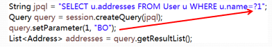
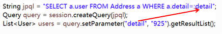
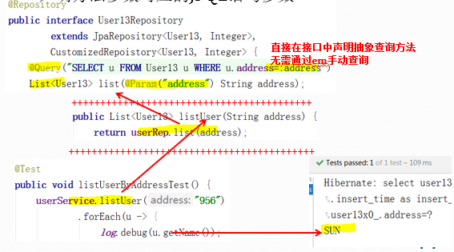
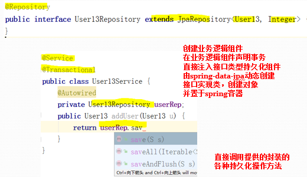
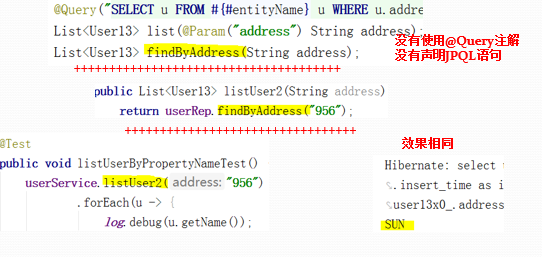

## Springboot-experiment

[TOC]

------


#### JPA实例  2019.03.11

**JPA基本映射声明方法：**

@Entity

- @Entity(javax.persistence.Entity)修饰声明实体类，springboot启动时，自动扫描全部实体类，不可重名

@Table

- Name：对应关系型数据库的数据表名，默认为实体类名，**当希望实体类名称与数据表名称不同，或名称与数据库关键字冲突时使用**

**基本属性的映射声明：**

- @Id：(javax.persistence.Id)修饰属性变量声明为主键，也可修饰主键的getter方法。
- @GeneratedValue的strategy字段声明主键生成策略
- JPA提供四种主键生成器策略
- - GenerationType.IDENTITY：自增长主键，多数数据库支持此策略(MySQL, SQL Server, PostgreSQL)
  - GenerationType.SEQUENCE：序列(Oracle)
  - GenerationType.TABLE：不依赖于数据库的具体实现，通过创建序列表维护表的主键，便于移植。
  - GenerationType.Auto：默认值。由JPA服务商选择生成策略，无法对具体数据库进行优化

- @Column
  - Name：指定该列的名字，默认名称与@column修饰的属性名相同。
  - nullable：指定该列是否允许为空，布尔型，默认值为true。
  - Length：指定该列保存数据的最大长度，默认长度225
  - **Insertable**：指定该列是否包含在JPA生成的insert语句的列的列表中，默认为true
  - **Updatable**：指定该列数否包含在JPA生成的update语句的列的列表中，默认为true
  - Unique：指定该列是否具有唯一约束，默认为false
  - **columnDefinition**：生成列时使用的SQL片段。


**实体对象关联对象的实现方法，映射声明**

- mappedBy出现在哪，哪端放弃维护
- 在many段维护关系，one端有一个集合？？？


1. 一对多    User  1—N   Address （由多的一方维护）

   ```java
   Address  多
   @ManyToOne
   private User user;
   
   User     一
   @OneToMany(mappedBy = "user")  （放弃维护）
   private List<Address> addresses;
   ```

2. 多对多   N—N   =>   Student 1—N  Elective  N—1 Course

   ```
   Course   一
   @OneToMany(mappedBy = "course")
   private List<Elective> electiveList;
   
   Student   一
   @OneToMany(mappedBy = "student")
   private List<Elective> electiveList;
   
   Elective   多
   @ManyToOne
   private Student student;
   @ManyToOne
   private Course course;
   ```


几个常用的注解

```
@Repository 声明组件
@Transactional   声明事物
@PersistenceContext  ？？？

@Autowired   注入组件
@RunWith(SpringRunner.class)  指定测试运行器
@SpringBootTest    声明为springboot测试类，可启动测试用Springboot
```


#### 实体对象状态实验  2019.03.18

- void persist(Object entity)

  - 将新建状态对象转为持久化状态

  - 对象是持久化状态，该方法被忽略

  - 对象是脱管状态，将抛出异常 (**有主键即判断为脱管对象**)

  - 对象是删除状态，将重新转为持久化状态

    

- Object find(Class entityClass, Object primaryKey)    //entityClass => 类.class

  - 没有匹配记录，返回null

  - 查询返回的结果是**受管对象**

  - 加载顺序：

    + 在持久化上下文中，查询相同类型相同主键受管对象 (看持久化上下文中是否存在)

    + 数据库中查询

      

- 事务结束后，受管对象自动同步到数据库，无需调用特定方法

  

- void flush()

  - 强制当前所有受管状态对象，**同步到数据库 （undo）**

  - 强制执行SQL更新语句以同步

  - 事务提交时自动执行此方法

  - 事务提交时自动执行此方法

    

+ void refresh(Object entity)
  - 强制数据库数据，同步到**受管对象**(基于主键)
  - 强制执行SQL查询语句以同步
  - 对象是新建状态，抛出异常
  - 对象是**受管状态**，同步受管对象
  - 对象是**脱管状态**，**抛出异常**
  - 对象是删除状态，抛出异常

```java
/**
* 更新指定地址为指定用户 ----- 使用merge()方法实现更新
* @param aid
* @param uid
* @return
*/
public Address updateAddress(int aid, int uid) {
    Address address1 = new Address();
    address1.setId(aid);   //有主键即判断为脱管对象
    Address address2 =  em.merge(address1);  //基于脱管对象的主键，从数据库查询数据，并封装到受管新对象,merge()方法将同步更新对象的全部属性!!!
    em.refresh(address2);                    //从数据库更新数据至受管对象，覆盖空数据
    User user = em.find(User.class, uid);    //根据uid查找用户
    address2.setUser(user);                  //merge()返回的新对象为受管状态
    return address2;
}

```


- **Object** merge(Object entity)

  - 对象为新建状态时，相当与执行persist()方法

  - 对象为脱管状态时

    - 基于脱管对象中的**主键**，从数据库查询数据，并封装到**新对象**
    - 将原脱管对象的修改合并至新对象
    - 原脱管状态对象依然为脱管状态
    - **返回的新对象为受管状态**

  - 对象为受管状态时，忽略执行

​      **并非将脱管状对象态变为受管状态:**将脱管对象的修改更新，但脱管对象依然为脱管状态，返回的**新对象**，为受管对象


- void remove(Object entity)

  - 对象是受管状态，将转为删除状态
  - 对象是脱管状态，将抛出异常
  - 对象是删除状态，将忽略
  - 仍然持有被删除对象的引用
  - persist()方法可将对象重置为受管状态


- cascade：指定对级联对象执行的级联操作策略

  - CascadeType.MERGE
  - CascadeType.PERSIST
  - CascadeType.REFRESH
  - CascadeType.REMOVE
  - CascadeType.ALL

```java
@OneToMany(mappedBy = "user", cascade = CascadeType.REMOVE)
private List<Address> addresses;
```


- fetch：指定对关联实体对象的抓取/加载策略

  - FetchType.EAGER：即时加载/抓取，对One端默认值
  - FetchType.LAZY：延迟加载/抓取，对Many端默认值

```java
/**
* 返回指定用户的全部地址，没有返回空集合，而非null
* @param uid
* @return
*/
public List<Address> listAddresses(int uid) {
    User user = em.find(User.class, uid);
    if (user != null) {
        List<Address> addressList = new ArrayList<>();
        user.getAddresses().forEach(a -> addressList.add(a));
        return addressList;     //如果直接返回user.getAddresses() 会报延迟加载异常
    }
    log.debug("未找到指定用户，返回空集合！！！");
    return List.of();
}
```


####  JPQL查询语言实验


JPQL

+ Querying Parameter

  + 根据参数位置设置参数 ?position

  

  

  + 根据参数名称设置参数 :name

  

  

  

- org.springframework.data.jpa.repository.Query注解，声明JPQL查询语句
- org.springframework.data.repository.query.Param注解，声明方法参数对应的JPQL语句参数





```
* org.springframework.data.repository.Interface CrudRepository<T,ID>，基本的ORM框架通用的支持CRUD的接口

* org.springframework.data.jpa.repository.Interface JpaRepository<T,ID>，继承以上接口的具体JPA接口

* JpaRepository接口，封装了改变实体对象状态的JPA方法，简化了基于实体对象的CRUD操作(无需关心实体对象状态)

* 为每一个实体类创建继承了JpaRepository的接口

* Spring-data-jpa基于JDK动态代理，自动创建接口实现类完成操作，无需手动编写接口实现类(类似myBatis)
```

JpaRepository接口中的常用方法(包含继承接口)

- long count()
- **void delete(T entity)**
- void deleteAll()
- `void deleteAll(Iterable<S> entities)`
- void deleteById(ID id)
- **List<T> findAll()**
- **Optional<T> findById(ID id)**
- **T save(T entity)**
- `List<S> saveAll(Iterable<S> entities)`
- void flush()
- S saveAndFlush(S entity)
- **不提供refresh()方法**


创建操作指定实体类的**接口**，继承JpaRepository，重写泛型，**指定实体类，主键的类型**




+ Persist，持久化保存，save()方法

+ Update，更新，save()方法默认基于主键更新，与是否为脱管状态无关

- 不提供refresh()基于对象的同步方法
- 基于主键的查询，Optional<T> findById()，返回对象封装在optional容器


Spring-data支持基于属性名称自动创建查询。即，仅按约定编写查询方法，无需编写JPQL语句


